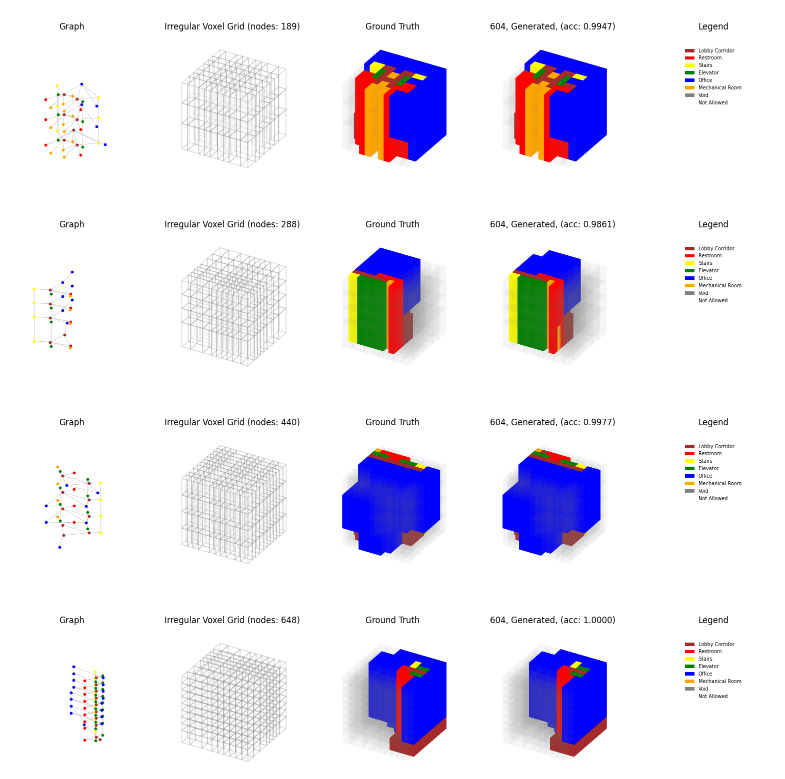

# building-gan-graph-conditioned-architectural-volume-generation

This repository explores the key contributions of [Building-GAN](https://arxiv.org/pdf/2104.13316) by AutodeskAILab: 1) a novel 3D representation called **voxel graph** that can encode **irregular voxel grids** with non-uniform space partitioning, overcoming limitations of traditional regular voxel grids, and 2) a graph-conditioned generative adversarial network (GAN) leveraging graph neural networks (GNNs). The implementation uses their [dataset](https://github.com/AutodeskAILab/Building-GAN?tab=readme-ov-file#:~:text=Download%20the%20dataset) to study these approaches.


<br>

<div>
    　　
</div>
<p align="center" color="gray">
<br>
  <i>
    Generated volumes, <br>
    the upper two generated volumes are training data, <br>
    and the lower two are validation data.
    </i>
</p>

# Installation

This repository uses the [image](/.devcontainer/Dockerfile) named `nvcr.io/nvidia/pytorch:23.10-py3` for running devcontainer.


1. Ensure you have Docker and Visual Studio Code with the Remote - Containers extension installed.
2. Clone the repository.

    ```
        git clone https://github.com/PARKCHEOLHEE-lab/building-gan-graph-conditioned-architectural-volume-generation.git
    ```

3. Open the project with VSCode.
4. When prompted at the bottom left on the VSCode, click `Reopen in Container` or use the command palette (F1) and select `Remote-Containers: Reopen in Container`.
5. VS Code will build the Docker container and set up the environment.
6. Once the container is built and running, you're ready to start working with the project.

<br>

# File Details
### data
- `building_gan/data/6types-processed_data/6types-processed_data.zip`: Data for training building-gan models. Unzip it

### notebooks
- `data-preprocessing.ipynb`: Data preprocessing of the original json-shaped data from this [repository](https://github.com/AutodeskAILab/Building-GAN?tab=readme-ov-file#:~:text=Download%20the%20dataset).
- `data-visualization.ipynb`: Data visualization of the original json-shaped data.
- `sanity-checking.ipynb`: Sanity checking of the model by testing whether the model overfits with a single data.
- `train.ipynb`: Training models, and evaluating models qualitatively through visualization of the generated data.

### runs
- `base`
    - `events.out.tfevents.1741657999.407685f53174.415.0`: TensorBoard event file containing metrics and logs trained using all data.
    - `states.pt`: Saved model checkpoint containing trained model weights and states trained using all data.
- `sanity-checking`
    - `events.out.tfevents.1741346830.407685f53174.1428.0`:  TensorBoard event file containing metrics and logs trained using a single data.

### src
- `config.py`: Configuration file containing model hyperparameters, data paths, and program type mappings
- `data.py`: Data loading and preprocessing utilities for graph-based building data
- `models.py`: Graph data-based GAN models including generator and discriminator architectures
- `trainer.py`: Training loop and evaluation code for the models

<br>

# How to run
1. Unzip the `building_gan/data/6types-processed_data/6types-processed_data.zip` file first, then you will see the following files:
    - `building_gan/data/6types-processed_data/004001_local.pt`
    - `building_gan/data/6types-processed_data/004001_voxel.pt` <br><br>
    ( ... ) <br><br>
    - `building_gan/data/6types-processed_data/009999_local.pt`
    - `building_gan/data/6types-processed_data/009999_voxel.pt`

2. Run the notebooks:

    - `train.ipynb`: Train the full model and evaluate results

3. Check training progress and results:
    -  How to check training metrics and generated samples in TensorBoard:

        ```
        tensorboard --logdir=runs
        ```
    - Check saved model checkpoints in `runs/base/states.pt`
    - Generated samples and evaluation results will be saved in the notebook outputs
